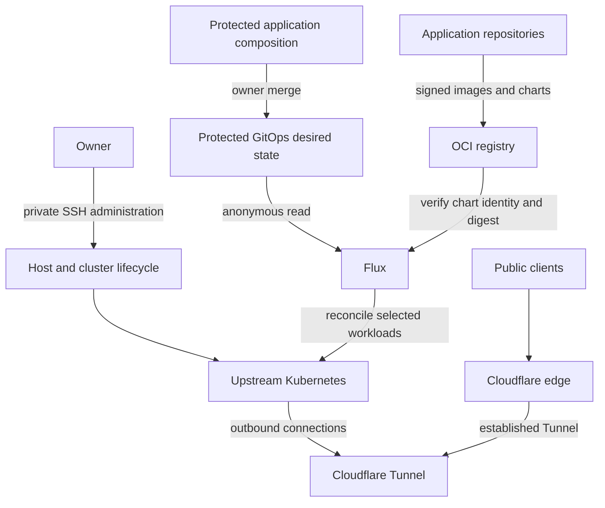

# Platform

[](https://github.com/snaraj/platform/actions/workflows/pull-request.yml)
[](https://github.com/snaraj/platform/actions/workflows/codeql.yml)
[](https://github.com/snaraj/platform/actions/workflows/scheduled-security.yml)
[](docs/badges/coverage.json)
[](https://github.com/snaraj/platform/releases)

A Kubernetes homelab platform for running services on privately operated
hardware. It brings host and cluster configuration, installed security
controls, network boundaries, and recovery procedures into a reviewable codebase.

The current platform uses upstream Kubernetes with kubeadm and containerd on
Raspberry Pi 5 hardware, Flux for GitOps, and Cloudflare for the public edge.
It is designed for a single owner operating trusted workloads. Public web
applications are its first workloads; the platform's scope includes the
infrastructure and operational controls underneath every service.

## Platform responsibilities

| Area | Responsibility |
| --- | --- |
| Host and cluster lifecycle | Reviewed bootstrap, pinned components, host prerequisites, runtime configuration, and recovery procedures |
| Workload operation | Namespace boundaries, service accounts, resource limits, and reconciliation authority |
| Delivery | Protected platform changes and immutable source-release history |
| Network and edge | Private administration, constrained workload flows, outbound Tunnel connectors, and audited provider configuration |
| Assurance | Repository privacy, secret scanning, policy tests, provenance checks, and explicit evidence for operational claims |

## Architecture



Administration and public application traffic have separate boundaries.
The administration plane is SSH-only. Public services use outbound Tunnel
connections and internal ClusterIP services; repository policy rejects public
origin records, public Kubernetes entry points, and host-network workloads.
Each exposed application has its own edge and release identity.

This is a single-node system. Power, storage, connectivity, and provider
failures can interrupt service. Recovery depends on reproducible configuration,
verified artifacts, and tested operational procedures; workload replicas do
not provide host redundancy.

## Delivery and change control

Application repositories own their source, images, Helm charts, and signing
identities. `platform-k8s-infra` consumes their independently verified releases:

1. An application publishes signed OCI artifacts and an immutable release.
2. A composition change verifies the release, chart, image, provenance, and
   source bindings and records the acquisition receipt.
3. Required CI and the exact-head review checks validate the proposed change.
4. The owner merges the PR. Flux reads protected `main`, verifies the selected
   chart, and reconciles its digest-bound workload.

Every protected-main merge also has a **platform source release**. After
successful main CI, the publisher derives the next patch from the annotated
tag ledger and signs a canonical identity binding the final source SHA,
predecessor, and workflow attempts. That immutable source record supports
audit and recovery. Application reconciliation follows the GitOps change;
it does not wait for platform source publication.

See [platform source releases](docs/runbooks/platform-source-releases.md) for
this repository's release contract and failure handling.

## Security model

The current threat model is a public configuration repository for a private,
single-owner homelab. It assumes trusted application workloads and explicit
owner control of production changes. Adding independent tenants, untrusted
workloads, or new public interfaces requires a fresh threat-model decision.

- **Protected changes.** Only the owner merges PRs. Required checks, signed
  commits, immutable history, and independent review govern security changes.
- **Artifact identity.** Deployments select full digests. Chart verification
  binds to the exact application publisher; provenance and acquisition
  receipts keep source, chart, and workload identities together.
- **Limited authority.** Flux reads public Git anonymously and holds no Git
  write credential. PR workflows are secretless; actions and tools are pinned.
  Source publication and repository-settings verification use separate jobs
  with distinct permissions.
- **Private operational data.** Runtime credentials, host inventory, account
  identifiers, and access details stay outside Git. Privacy validators and
  secret scans cover both the working tree and outgoing history.
- **Closed defaults.** Unknown identities, missing evidence, unresolved
  sentinels, and unsupported exposure fail validation. Provider configuration
  is restricted to the explicitly approved zero-spend product set.

The [threat model](docs/security/threat-model.md),
[control matrix](docs/security/security-control-matrix.md), and
[architecture decisions](docs/adr/) describe the controls and their limits.
Static policy checks prove repository properties; claims about live enforcement
require current operational evidence.

## Workloads

| Workload | Application source |
| --- | --- |
| [naranjo.online](https://naranjo.online) | [snaraj/naranjo.online](https://github.com/snaraj/naranjo.online) |
| [lidersea.com](https://lidersea.com) | [snaraj/lidersea.com](https://github.com/snaraj/lidersea.com) |

Selected chart digests and their acquisition evidence live in the application
composition. Application repositories own each workload's image, chart and
signed release history.

## Repository layout

```text
bootstrap/          host, cluster, Flux, and recovery entry points
kubernetes/         installed controllers, isolation and platform services
policies/           static policy and publication controls
scripts/            delivery, verification, and operational tooling
tests/              contract tests and allow/deny fixtures
docs/               architecture, decisions, assurance, and runbooks
```

| Repository | Responsibility |
| --- | --- |
| [platform](https://github.com/snaraj/platform) | Host and cluster lifecycle, security controls, namespaces, controller authority, Git sources and recovery |
| [platform-k8s-infra](https://github.com/snaraj/platform-k8s-infra) | Application composition, default-deny policies and verified chart selections |
| Application repositories | Application code, images, Helm charts and signed releases |

The source configured in the cluster determines which protected composition it
consumes. Source changes follow the
[application source transition runbook](docs/runbooks/application-source-transition.md),
with current convergence and rollback evidence.

## Development and review

Start with [AGENTS.md](AGENTS.md) for contribution, review, and authority rules.
The same contract applies to human and automated contributors.

```sh
make check-fast        # repository validators and the full Python test suite
make check             # pinned policy, render, shell and workflow checks
make coverage          # coverage floor, drift, and badge integrity
make pre-push-security # exact outgoing history and publication checks
```

`check-fast` requires Python and Git. The complete toolchain is pinned in
[versions.env](versions.env); the
[local development runbook](docs/runbooks/local-macos-development.md) covers
setup. Use the repository's `.githooks` pre-push hook when publishing changes.
Coverage is measured locally and in CI without an external coverage service.

For operation, use the [runbooks](docs/runbooks/) and their evidence and
recovery preconditions. A script's presence is not authorization to run it
against a live system.

For reuse elsewhere, review the architecture and replace each complete
workload, publisher, and provider identity tuple. Retain unresolved values
until validated against the new environment. This repository is an operational
reference with explicit constraints, rather than a general-purpose installer.
